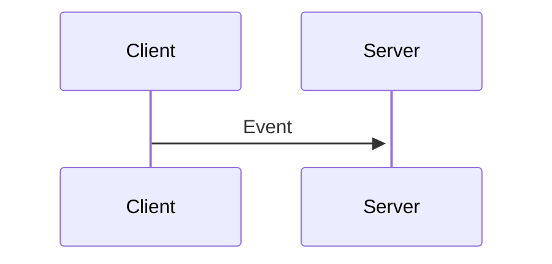
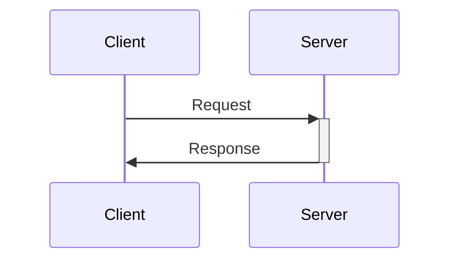
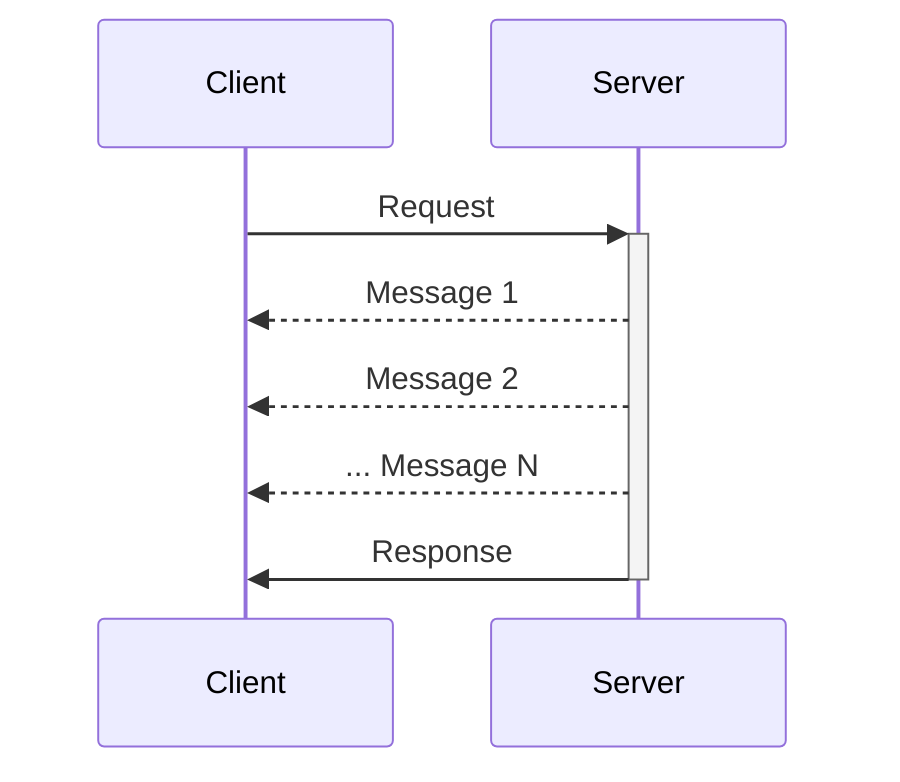
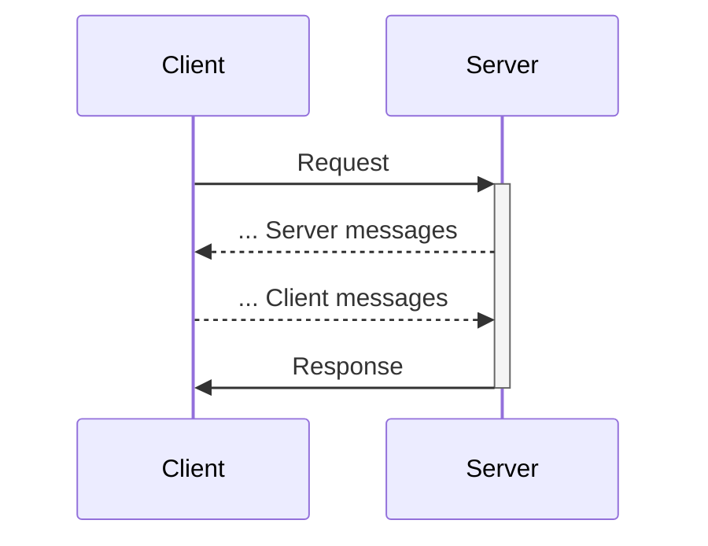

# Discover Enkaku

Go beyond JSON-RPC with Enkaku! Define stateless or stateful interactions between your client and server, authenticate and validate incoming messages, all using any transport you need.

## Stateless or stateful - define the commands you want

Enaku supports 4 types of commands to interact between a client and server:

### Events

"Fire and forget" command the client sends to the server without expecting a response.

### Requests

The client sends a request to the server and waits for a single response.

### Streams

The client sends a request to the server and expects a stream of responses.

### Channels

The client sends a request to the server and expects a stream of responses, while being able to send futher messages to the created channel.

## Validate and authenticate as needed

Enkaku uses [JSON schema](https://json-schema.org/) to define and validate the messages exchanged between the client and server.

All messages are structures as [JSON Web Token](https://jwt.io/) objects that can be signed to ensure the integrity of the messages and authenticate the sender.

## Run your clients and servers anywhere JS goes

HTTP is great but there are so many other places where client-server interactions are relevant in JS applications, such as [Web Workers](https://developer.mozilla.org/en-US/docs/Web/API/Web_Workers_API), [Node child proceses](https://nodejs.org/api/child_process.html), [Electron processes](https://www.electronjs.org/docs/latest/tutorial/ipc) and many others.

Enkaku provides a simple transport interface based on [Web Streams](https://developer.mozilla.org/en-US/docs/Web/API/Streams_API) to support a wide range of communication APIs.
