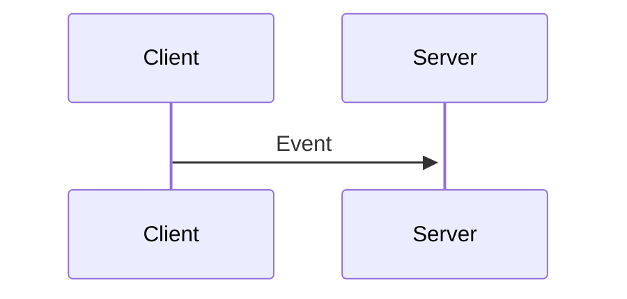
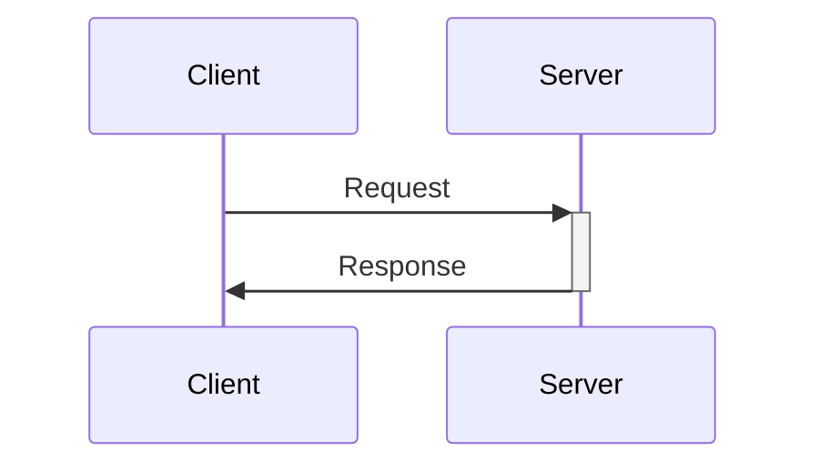
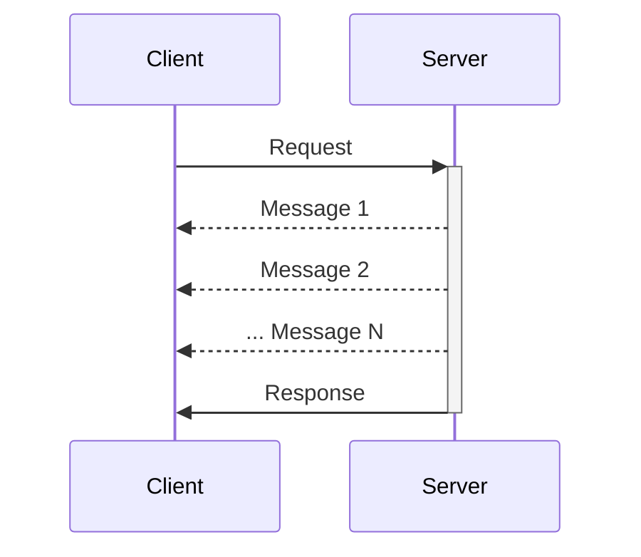
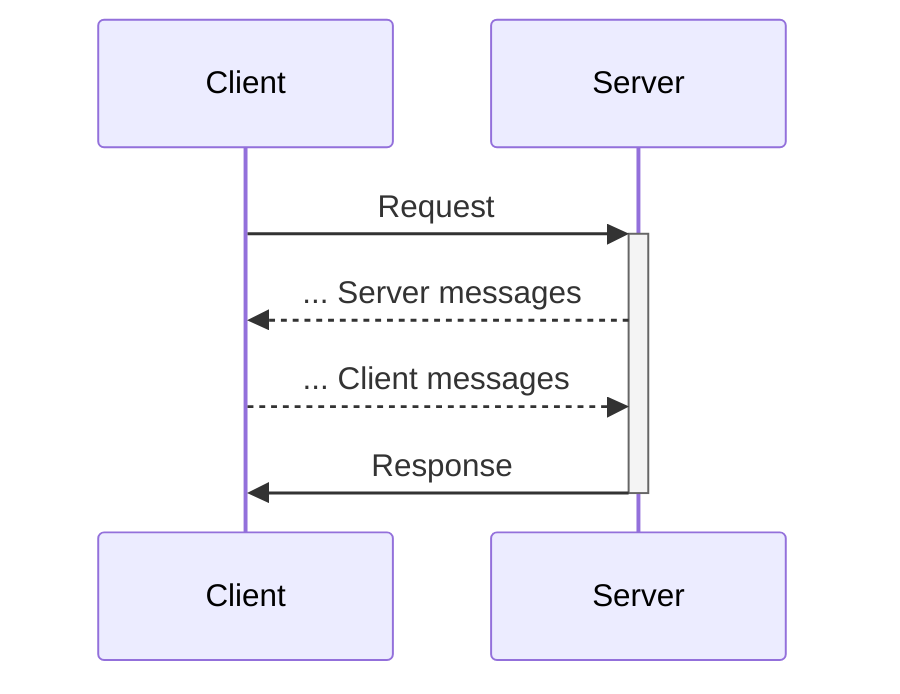

# Procedures

Procedures are functions handled by a server that can be called by clients.

## Defining procedures

Enkaku supports the following four types of procedures: [events](#events), [requests](#requests), [streams](#streams) and [channels](#channels).

Events and requests calls are supported by staless handlers, while streams and channels require stateful handlers to support sending messages from the server to the client.

Defining procedures involves creating a protocol for the client and server, typically using the `ProtocolDefinition` type from the `@enkaku/protocol` package.

A protocol is defined as a record of procedure names to procedure definitions. Each procedure definition must include the type of procedure (`event`, `request`, `stream` or `channel`), an optional `description` for documentation purposes, and any additional data types required by the procedure.

Procedure names have no particular constraints other than being unique strings within the protocol or set of protocols used on a given transport.

Example protocol definition:

```ts
import type { ProtocolDefinition } from '@enkaku/protocol'

export const myProtocol = {
  'myapp:event': {
    type: 'event',
    description: 'An example event procedure with no data',
  },
  'myapp:request': {
    type: 'request',
    description: 'An example request procedure that returns a string',
    response: { type: 'string' },
  },
  'myapp:stream': {
    type: 'stream',
    description: 'An example stream procedure that returns a stream of numbers',
    receive: { type: 'number' },
  },
  'myapp:channel': {
    type: 'channel',
    description: 'An example channel procedure that sends and receives numbers',
    send: { type: 'number' },
    receive: { type: 'number' },
  },
} as const satisfies ProtocolDefinition
```

### Events

Events are simple "fire and forget" calls that the client sends to the server without expecting a response.



To define an event procedure in Enkaku, the `type` must be set to `event`, for example:

```ts
import type { ProtocolDefinition } from '@enkaku/protocol'

const protocol = {
  'myapp:event': {
    type: 'event',
    description: 'An example event procedure with no data',
  },
} as const satisfies ProtocolDefinition
```

Events can also have a data object attached to them, which must be defined as a JSON schema in the protocol:

```ts
import type { ProtocolDefinition } from '@enkaku/protocol'

const protocol = {
  'my:event': {
    type: 'event',
    description: 'An example event procedure with data',
    data: {
      type: 'object',
      properties: {
        value: { type: 'number' },
      },
    },
  },
} as const satisfies ProtocolDefinition
```

### Requests

Requests are calls the clients sends to the server expecting a single response to be returned.



Requests may have parameters associated to them using the `params` property and a `result` property representing the type of a successful response, as in the example below: 

```ts
import type { ProtocolDefinition } from '@enkaku/protocol'

const protocol = {
  'myapp:users/exists': {
    type: 'request',
    description: 'An example request procedure with parameters and result'
    params: {
      type: 'string',
      description: 'user ID',
    },
    result: { type: 'boolean' },
  },
} as const satisfies ProtocolDefinition
```

Requests may also not define any `params` or `result`, for example:

```ts
import type { ProtocolDefinition } from '@enkaku/protocol'

const protocol = {
  'myapp:request': {
    type: 'request',
    description: 'An example request procedure with no parameters and result',
  },
} as const satisfies ProtocolDefinition
```

### Streams

A stream is a stateful procedure that maintains a connection between the client and server until either the client or server closes it, or an error happens.



Like requests, streams can have optional parameters associated to them using the `params` property and a `result` property defining the type of data that is sent back from the server once the stream is ended.

Stream definions must provide a `receive` property that represents the type of data sent by the server while the client is connected to it.

```ts
import type { ProtocolDefinition } from '@enkaku/protocol'

const protocol = {
  'myapp:stream-numbers': {
    type: 'stream',
    description: 'An example stream procedure sending numbers',
    params: {
      type: 'number',
      description: 'The number to start from',
    },
    receive: { type: 'number' },
    result: {
      type: 'object',
      properties: {
        sum: { type: 'number', description: 'The sum of all numbers sent' },
      },
      required: ['sum'],
    },
  },
} as const satisfies ProtocolDefinition
```

### Channels

Similar to streams, channels are stateful procedures that maintain a connection between the client and server until explicitly closed by either side or an error occurs. Unlike streams, however, channels can be used for bidirectional communication.



Like requests and streams, channels can have optional parameters associated to them using the `params` property and a `result` property defining the type of data that is sent back from the server once the channel is closed by the server.

Similar to stream definions, channel definitions must provide a `receive` property that represents the type of data sent by the server while the client is connected to it.

Channel definitions must also provide the `send` property which defines the type of data that can be sent from the client to the server.

```ts
import type { ProtocolDefinition } from '@enkaku/protocol'

const protocol = {
  'myapp:live-presence': {
    type: 'channel',
    description: 'An example channel procedure tracking present users',
    params: {
      type: 'object',
      properties: {
        room_id: { type: 'string', description: 'The ID of the room' },
        active_time: { type: 'integer' },
      },
      required: ['room_id'],
    },
    send: { type: 'boolean', description: 'Toggle presence in the room' },
    receive: { type: 'number', description: 'Number of users in the room' },
  },
} as const satisfies ProtocolDefinition
```

Using channels, it is possible to create sub-protocols such as allowing the server to make requests to the client instead of the client making requests to the server.
The relation between messages being sent and received in a channel is fully up to the client and server logic.

## Handling procedures

Handling procedures on the server side is done by defining a mapping of procedure names to handler functions.

Handler functions are called with a single argument, which is an object containing the `message` object received by the server.

In addition to the `message` object, the following properties will be present based on the type of procedure:

- `data` for event procedures having defined a `data` property, an object containing the data passed by the client.
- `signal` for all cancellable (non-event) procedures, an [AbortSignal](https://developer.mozilla.org/en-US/docs/Web/API/AbortSignal) triggered when the client cancels the procedure.
- `params` for all non-event procedures having defined a `params` property, an object containing the parameters passed by the client.
- `writer` for all stream and channel procedures, a [`WritableStreamDefaultWriter`](https://developer.mozilla.org/en-US/docs/Web/API/WritableStreamDefaultWriter) used to write data back to the client matching the `receive` property of the procedure definition.
- `reader` for all channel procedures, a [`WritableStreamDefaultReader`](https://developer.mozilla.org/en-US/docs/Web/API/WritableStreamDefaultReader) used to read data sent by the client matching the `send` property of the procedure definition.

Handler functions for non-event procedures should return a value or promise according to the `result` property of the procedure definition, which will be sent back to the client.

### Defining handlers

Handlers can be attached to a server using the [`serve()` function from the `@enkaku/server` package](./api/server/index.md#serve), for example:

```ts
import type { ProtocolDefinition } from '@enkaku/protocol'
import { serve } from '@enkaku/server'

const protocol = {
  'myapp:users/exists': {
    type: 'request',
    description: 'An example request procedure with parameters and result'
    params: {
      type: 'string',
      description: 'user ID',
    },
    result: { type: 'boolean' },
  },
} as const satisfies ProtocolDefinition

serve({
  // ... other parameters omitted for brevity
  protocol,
  handlers: {
    'myapp:users/exists': async (ctx) => {
      // Get the user ID, defined as string in the protocol definition
      const id = ctx.params 
      // Return the result matching the protocol definition
      return await myDB.users.exists(id)
    }
  }
})
```

### Cancellations

The context object passed to handlers for cancellable (non-event) procedures contains a `signal` property triggered when the client aborts the procedure, for example to cancel a request or stop the execution of a stream or channel. The signal is an instance of [`AbortSignal`](https://developer.mozilla.org/en-US/docs/Web/API/AbortSignal).

The following example presents a stream procedure handling the interruption of the procedure by the client:

```ts
import type { ProtocolDefinition } from '@enkaku/protocol'
import { serve } from '@enkaku/server'

const protocol = {
  'myapp:stream-numbers': {
    type: 'stream',
    description: 'An example stream procedure sending numbers',
    params: {
      type: 'number',
      description: 'The number to start from',
    },
    receive: { type: 'number' },
    result: {
      type: 'object',
      properties: {
        sum: { type: 'number', description: 'The sum of all numbers sent' },
      },
      required: ['sum'],
    },
  },
} as const satisfies ProtocolDefinition

serve({
  // ... other parameters omitted for brevity
  protocol,
  handlers: {
    'myapp:stream-numbers': async (ctx) => {
      // Get the first number from the client
      let value = ctx.params
      let sum = value
      // Execute as long as the client does not close the stream
      while (!ctx.signal.aborted) {
        // Get the next number somehow
        value = await getNextNumber(value)
        if (value == null) {
          // No more values - return the sum as result
          return sum
        }
        // Add the new value to the sum
        sum += value
        // Write the next number to the stream
        ctx.writer.write(value)
      }
      
    }
  }
})
```

## Invoking procedures

The easiest way to invoke procedures is to create a client by using the [`@enkaku/client` package](./api/client/index.md).

The client exposes the following methods to invoke procedures:

- [`sendEvent()`](./api/client/index.md#sendevent) to send an [`event`](#events).
- [`request()`](./api/client/index.md#request) to send a [`request`](#requests).
- [`createStream()`](./api/client/index.md#createstream) to create a [`stream`](#streams).
- [`createChannel()`](./api/client/index.md#createchannel) to create a [`channel`](#channels).

All these methods return a `Promise` that resolves when the message is **successfully written** to the transport, or rejects if the message cannot be sent.

### Procedure call state

While the `sendEvent()` method returns a `Promise<void>` as no further interaction is expected, the other three methods synchronously return a [`ProcedureCall` object](./api/client/index.md#procedurecallresultvalue-return) containing the following properties:

- `result`: a `Promise` or a [`Result` type from the `typescript-result` package](https://github.com/everweij/typescript-result?tab=readme-ov-file#result) containing the result of the procedure call or error.
- `toValue()`: a `Promise` of the result value of the procedure call, or throwing an error if the call fails.

In addition to the properties above, the `ProcedureCall` object is itself a `Promise` resolving to an object with the following values:

- `abort()`: function to call to abort the procedure call.
- `id`: unique identifier of the procedure call.
- `result`: a `Promise` or a [`Result` type from the `typescript-result` package](https://github.com/everweij/typescript-result?tab=readme-ov-file#result) containing the result of the procedure call or error.

When calling the `createStream()` or `createChannel()` method, the object returned by the `Promise` also contain a `receive` property being a [`ReadableStream`](https://developer.mozilla.org/en-US/docs/Web/API/ReadableStream) containing the stream data sent by the server.
A `send(data): Promise<void>` function is also present to send data to the server when using the `createChannel()` method.

```ts 
import { Client } from '@enkaku/client'

const client = new Client({
  // ... params omitted for brevity
})

const request = client.request('example:request')

const valuePromise = request.toValue() // Promise resolving to the result value or rejecting with an error
const resultPromise = request.result // Promise of a Result object

const requestState = await request // state object available after the message has been written to the transport
const requestID = requestState.id // unique ID for this request

requestState.abort() // aborts the request if it hasn't already completed

const sameResultPromise = requestState.result // same as request.result 
```